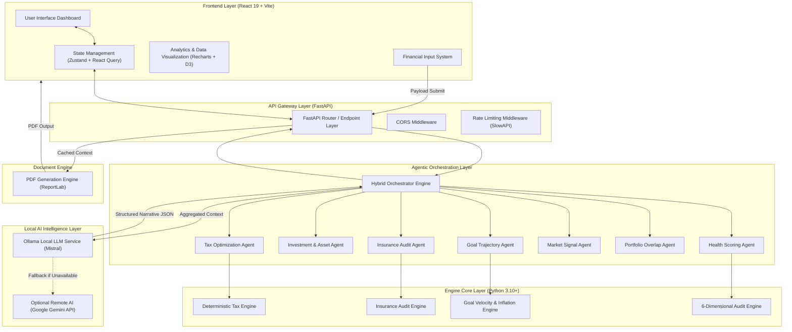
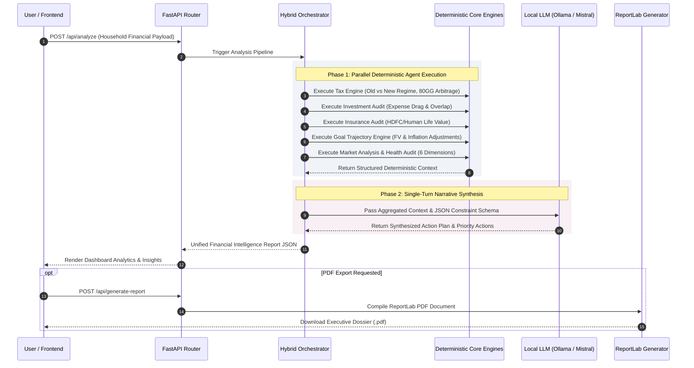

# Strategy Optimization Workspace (SOW)

**Version 2.0.0**

SOW (Strategy Optimization Workspace) is an enterprise-grade, private-first financial intelligence engine designed for Indian joint households. Built on a hybrid architecture combining deterministic financial calculation modules with local Large Language Model (LLM) agents, SOW performs cross-partner tax optimization, wealth-leakage analysis, multi-dimensional risk audits, and automated executive dossier generation without transmitting sensitive financial payload off-device.

---

## Executive Summary

Modern household financial management requires analyzing complex interdependencies across dual-income tax regimes, asset allocation overlaps, risk coverage gaps, and long-term goal trajectory calculations. Traditional tools evaluate individuals in isolation, missing structural tax arbitrage and household-level synergies.

SOW addresses this gap by executing a 7-agent deterministic analysis pipeline for both partners simultaneously, followed by a unified LLM narrative synthesis layer. The platform evaluates:
- **Tax Arbitrage**: Dual-regime optimization (Old vs. New Income Tax Act regimes) and Section 80GG / HRA allocation strategies.
- **Wealth Leakage Identification**: Overlapping mutual fund holdings, expense ratio drag, under-insurance penalties, and unoptimized debt interest.
- **6-Dimensional Health Audit**: Quantitative scoring across Liquidity, Debt Solvency, Risk Protection, Retirement Velocity, Tax Efficiency, and Portfolio Diversification.
- **Automated Dossier Generation**: High-fidelity PDF report generation for executive review.

---

## System Architecture

The application is structured as a decoupled client-server architecture with a local AI orchestration layer.



---

## Multi-Agent Execution Pipeline

The core analytical pipeline utilizes a two-stage execution model: deterministic mathematical evaluation followed by natural language narrative synthesis.



---

## Key Capabilities

### 1. Dual-Partner Tax Regime Optimization
Evaluates the Indian Income Tax Act (Old Tax Regime vs. New Tax Regime under Section 115BAC) simultaneously for both partners. Calculates exact household tax liability across combinations and identifies optimal HRA claimant strategies and Section 80GG deductions for self-employed/entrepreneurial profiles.

### 2. Multi-Agent Financial Audit Engine
The system coordinates 7 specialized agents:
- **Tax Agent**: Computes regime arbitrage, deductions, and exemption strategies.
- **Investment Agent**: Identifies yield drag, emergency buffer adequacy, and asset class distribution.
- **Insurance Agent**: Calculates Human Life Value (HLV) gap using standard income multipliers and medical coverage minimums.
- **Goal Agent**: Projects inflation-adjusted future values for retirement, real estate, and education goals.
- **Market Agent**: Cross-references asset portfolios against market benchmark signals.
- **Portfolio Agent**: Detects overlap percentage across mutual fund holdings to reduce concentration risk.
- **Health Agent**: Computes a standardized 100-point financial health score across six distinct operational dimensions.

### 3. Local-First Privacy Architecture
All quantitative computations and narrative synthesis execute locally via Ollama (`mistral` model). No user identifiers, financial values, or tax documents leave the local network environment.

### 4. Enterprise PDF Dossier Compilation
Generates PDF financial dossiers complete with executive summaries, regime comparison matrices, radar score distributions, and prioritized action roadmaps.

---

## Technical Stack

| Layer | Technology | Function / Purpose |
| :--- | :--- | :--- |
| **Backend Framework** | FastAPI (Python 3.10+) | Asynchronous REST API server & middleware orchestration |
| **Server Engine** | Uvicorn | High-performance ASGI server implementation |
| **Local LLM Engine** | Ollama / Mistral | On-premise narrative synthesis & action plan extraction |
| **Fallback LLM** | Google Gemini API (`google-genai`) | Optional secondary LLM synthesis layer |
| **PDF Generation** | ReportLab | Programmatic vector PDF compilation |
| **Rate Limiting** | SlowAPI | Client request rate regulation |
| **Frontend Framework** | React 19 / Vite | Dynamic single-page client interface |
| **State Management** | Zustand & React Query | Global state store & asynchronous API caching |
| **Styling & UI** | Tailwind CSS / PostCSS | Utility-first responsive design framework |
| **Data Visualization** | Recharts & D3.js | Financial charts, gauge meters, and matrix plots |
| **Form Validation** | React Hook Form & Zod | Client-side schema validation |

---

## Repository Directory Structure

```
SOW-K-A-/
├── backend/
│   ├── agents/
│   │   ├── goal_agent.py          # Goal trajectory calculation agent
│   │   ├── health_agent.py        # 6-dimensional health score agent
│   │   ├── insurance_agent.py     # Coverage gap & HLV agent
│   │   ├── investment_agent.py    # Asset allocation & yield agent
│   │   ├── market_agent.py        # Portfolio market signal agent
│   │   ├── orchestrator.py        # Hybrid multi-agent coordinator
│   │   ├── orchestrator_fallback.py # Pure-math fallback orchestration
│   │   ├── portfolio_agent.py     # Mutual fund overlap agent
│   │   └── tax_agent.py           # Dual-regime tax agent
│   ├── core/
│   │   ├── config.py              # Environment & system configurations
│   │   ├── goal_math.py           # Inflation & future value formulas
│   │   ├── insurance_calc.py      # Insurance gap algorithms
│   │   ├── optimizer.py           # Tax combination optimizer
│   │   ├── state.py               # Shared execution state structures
│   │   └── tax_engine.py          # Deterministic Indian Tax Act engine
│   ├── models/                    # Pydantic data schemas
│   ├── report/                    # ReportLab PDF template generators
│   ├── routes/                    # FastAPI route handlers
│   ├── main.py                    # Application entry point & middleware
│   └── requirements.txt           # Python backend dependencies
├── frontend/
│   ├── public/                    # Static public assets
│   ├── src/                       # React application source code
│   ├── package.json               # Node.js dependencies & scripts
│   ├── tailwind.config.js         # Tailwind configuration
│   └── vite.config.js             # Vite build configuration
├── README.md                      # Project documentation
└── TEST_DATA.md                   # Comprehensive test scenario data
```

---

## Setup & Installation

### Prerequisites
- **Python**: Version 3.10 or higher
- **Node.js**: Version 18.0 or higher
- **Ollama**: Installed locally for LLM execution ([Download Ollama](https://ollama.com))

### 1. Local LLM Setup
Initialize and pull the required Mistral model:
```bash
ollama serve
ollama pull mistral
```

### 2. Backend Setup
Navigate to the backend directory, configure a virtual environment, and install dependencies:
```bash
cd backend
python -m venv venv

# Windows PowerShell:
.\venv\Scripts\Activate.ps1

# Linux / macOS:
source venv/bin/activate

pip install -r requirements.txt
```

### 3. Environment Configuration
Create a `.env` file in the `backend/` root directory:
```env
OLLAMA_URL=http://localhost:11434/api/generate
OLLAMA_MODEL=mistral
GEMINI_API_KEY=
BACKEND_PORT=8000
```
*Note: `GEMINI_API_KEY` is optional. The application defaults strictly to local Ollama execution when omitted.*

### 4. Frontend Setup
Navigate to the frontend directory and install dependencies:
```bash
cd frontend
npm install
```

---

## Execution Guide

To operate SOW, run the three core services concurrently:

| Service | Execution Command | Listening Address |
| :--- | :--- | :--- |
| **Local LLM Engine** | `ollama serve` | `http://localhost:11434` |
| **FastAPI Backend** | `cd backend && python main.py` | `http://localhost:8000` |
| **Frontend Web App** | `cd frontend && npm run dev` | `http://localhost:5173` |

Access the dashboard by navigating to `http://localhost:5173` in a web browser.

---

## API Reference

### Health Check
- **GET** `/api/health`
  - Returns backend operational status and version metadata.

### Analyze Household Payload
- **POST** `/api/analyze`
  - Accepts full financial JSON schema containing income, tax deductions, investments, insurance policies, liabilities, and financial goals for Primary and Partner profiles.
  - Returns calculated tax savings, regime recommendations, 6-dimensional health score, risk audit, and prioritized action plan.

### Upload Financial Statement
- **POST** `/api/upload-pdf`
  - Parses uploaded financial statements or tax documents for automated field extraction.

### Generate PDF Report
- **POST** `/api/generate-report`
  - Compiles current analysis context into a downloadable PDF report.

---

## Verification & Testing Workflow

Refer to `TEST_DATA.md` in the root repository directory for pre-configured financial profiles.

### Validation Scenarios
1. **Scenario A (Standard Salaried Couple)**:
   - Verifies regime switching benefit (Old Regime under 80C/80D vs New Regime under 115BAC).
2. **Scenario B (Entrepreneur & Freelancer Duo)**:
   - Validates Section 80GG rent deduction rules for business entities without HRA component.
3. **Robustness Verification**:
   - Verify local log outputs to observe the automatic JSON schema repair mechanism when processing raw LLM outputs.

---

## Security & Data Privacy Controls

- **Zero Data Persistence**: Household financial inputs remain strictly in-memory during analysis execution. No database storage or persistent identifier logging occurs.
- **Local Network Isolation**: Primary LLM synthesis defaults to local execution (`localhost:11434`), eliminating third-party data transmission.
- **In-Container Document Assembly**: PDF generation is performed locally via pure Python byte streams without external render engine dependencies.

---

## License & Support

Internal Enterprise Intelligence Application — SOW Strategy Team.

